# Simulador de um sistema de votação


> Simulador do sistema de votação brasileiro feito em Python.

## 💻 Demonstração

### Menu

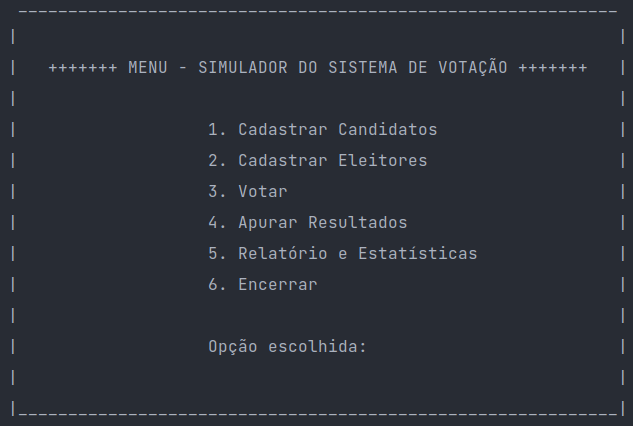

### Registro de candidato

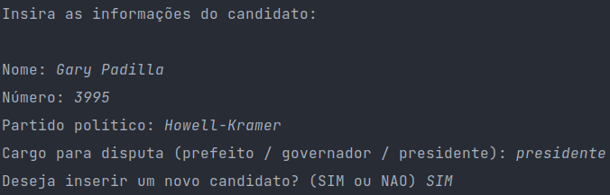

### Registro de eleitor

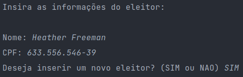

### Votação

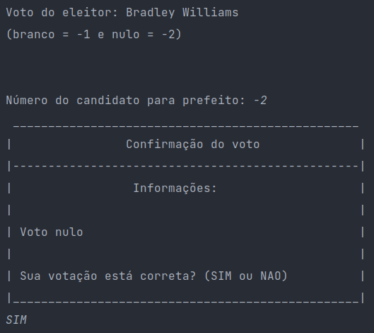

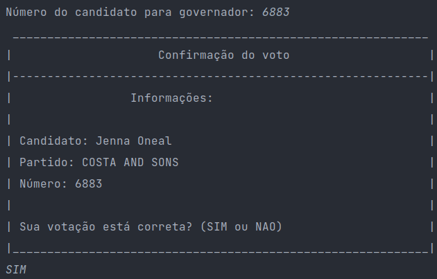

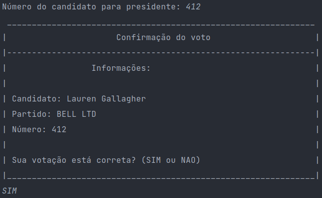

### Resultados


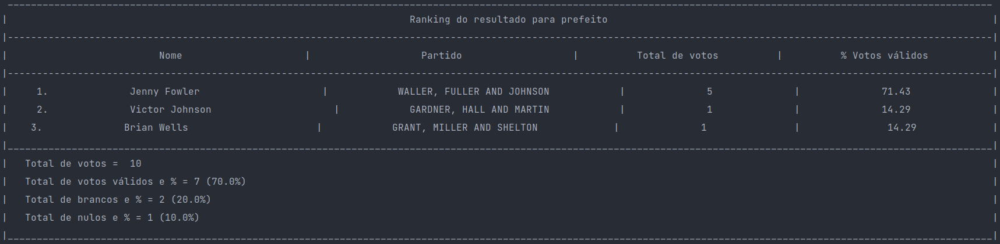

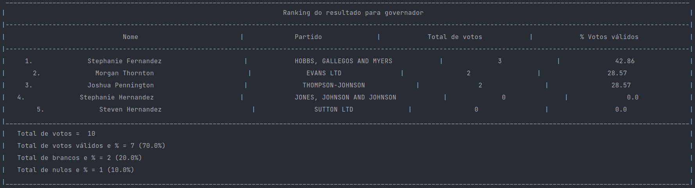

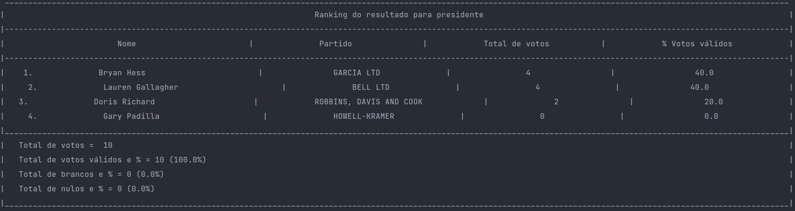

### Relatórios

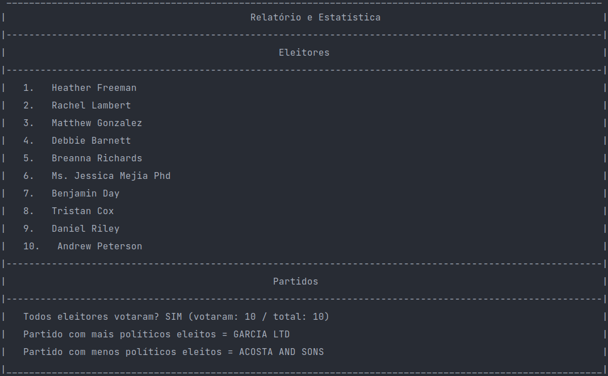

### Fim

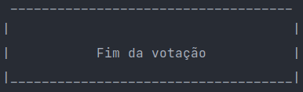

## ⚠️ Pré-requisitos

- [Python 3.10+](https://www.python.org/downloads/)

- [PyCharm Community](https://www.jetbrains.com/pycharm/download/)

## 💡 Conceitos

### Algoritmo e Programação I

- Estruturas condicionais

- Estruturas de repetição

- Escopo de variáveis

- Sub-rotinas (funções)

- Manipulação e formatação de string

- Estruturas de dados: lista, dicionário, tupla

- Algoritmo de ordenação (_Tim Sort_)

- Leitura de arquivos

### Matemática Discreta I

- Leis de De Morgan

- Validação de CPF

## 🚀 Execução do projeto

```bash
# Clone do repositório
$ git clone https://github.com/ImGabreuw/sistema-de-votacao.git

# Acessar o diretório do projeto
$ cd sistema-de-votacao

# Instação de dependências
$ pip install -r requirements.txt

# Executar o projeto
$ python main.py
```

## 📫 Contribuição

Para contribuir com **sistema-de-votacao**, siga estas etapas:

1. Bifurque este repositório.
2. Crie um branch: `git checkout -b <nome da funcionalidade>`.
3. Faça suas alterações e confirme-as: `git commit -m '<breve descrição sobre a funcionalidade>'`
4. Envie para o branch original: `git push origin <feature/funcionalidade>`
5. Crie a solicitação de pull.

Como alternativa, consulte a documentação do GitHub
em [como criar uma solicitação pull](https://help.github.com/en/github/collaborating-with-issues-and-pull-requests/creating-a-pull-request).

## 🤝 Colaboradores

Agradecemos às seguintes pessoas que contribuíram para este projeto:

<table>
  <tr>
    <td align="center">
      <a href="https://github.com/ImGabreuw">
        <br>
        <sub>
          <b>ImGabreuw</b>
        </sub>
      </a>
    </td>
    <td align="center">
      <a href="https://github.com/Enzo-B-Proenca">
        <br>
        <sub>
          <b>Enzo-B-Proenca</b>
        </sub>
      </a>
    </td>
  </tr>
</table>

[⬆ Voltar ao topo](#sistema-de-votacao)<br>